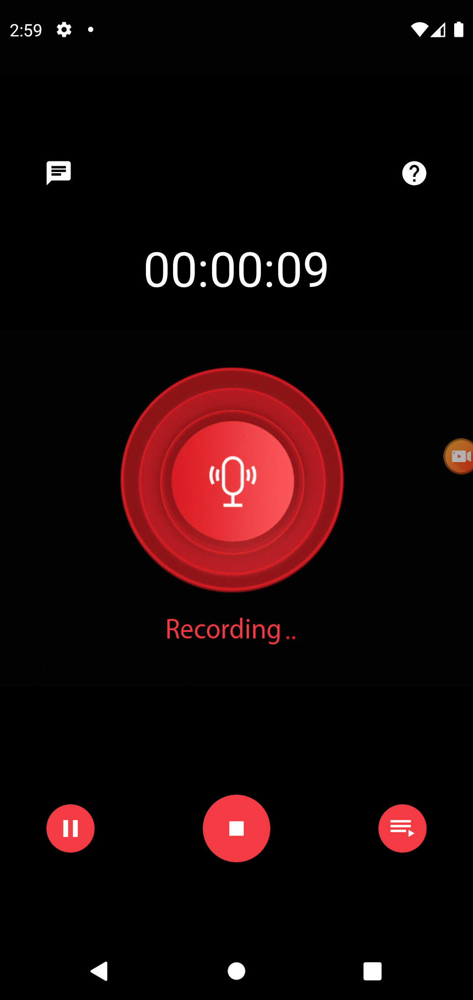
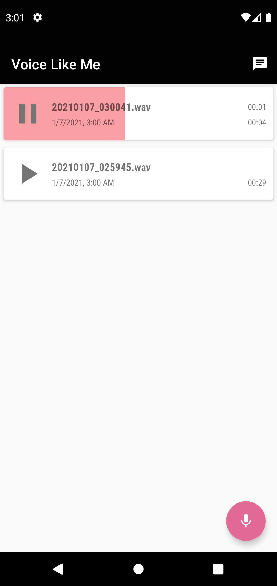
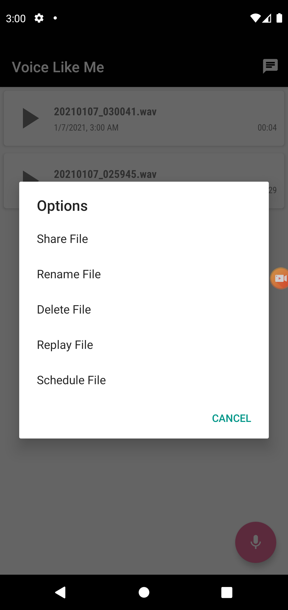
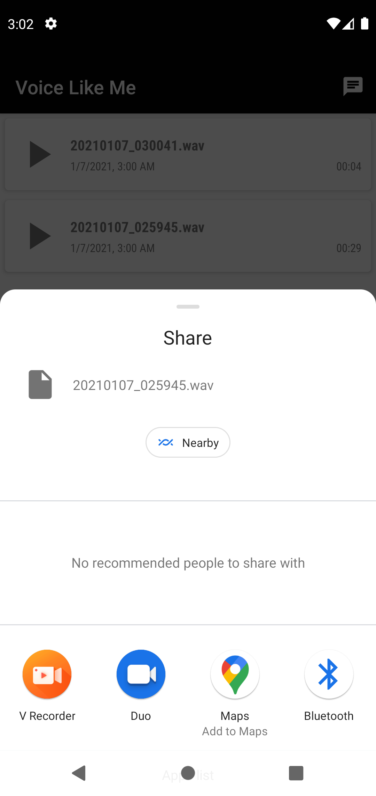
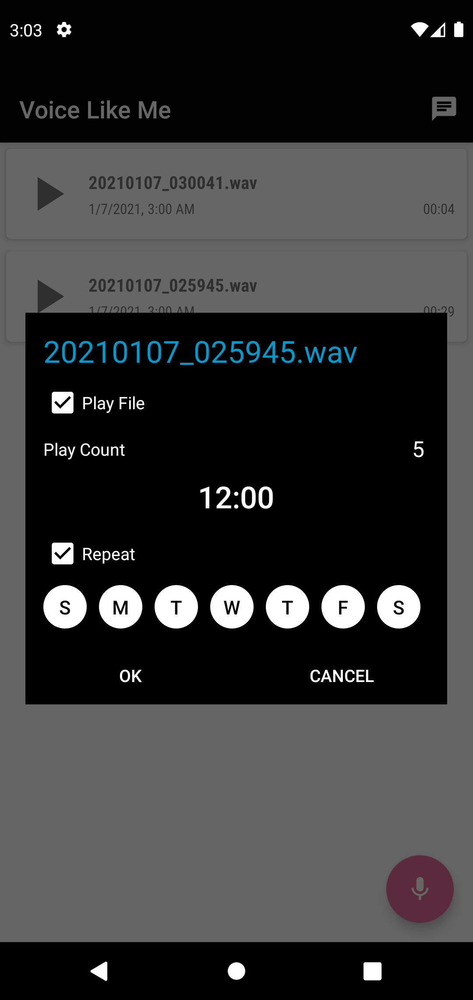
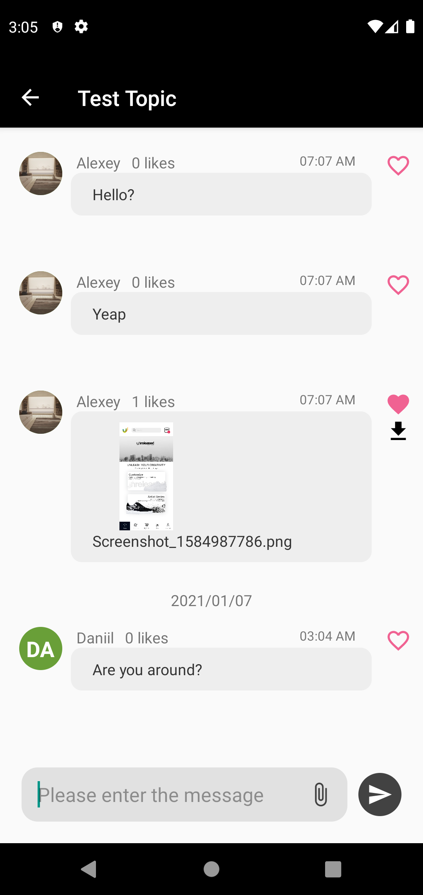

# VoiceLikeMe-Android

VoiceLikeMe-Android is an android application to denoise while recording your voice and manage them like **Replay**, **Share**, **Rename**,  **Delete**, **Schedule Amarm/Notification**, supported for English and Japanese.

**Speex 1.2rc2 and SpeexDSP 1.2rc2** was used as denoise algorithm and it can be referenced from https://www.speex.org/.
**Speex** denoise algorithm should be used with as Raw binary audio data like *.wav.

### To build speex engine developed with C programming language by using NDK.
- Install NDK with SDK manager on Android Studio.
- Copy C source files (all files in jni) into installed NDK path.
- run *cd installed NDK path* on CMD.
- run *ndk-build* command on CMD.

You can get help from https://appbestsmile.com/productsaffirmation/.

     